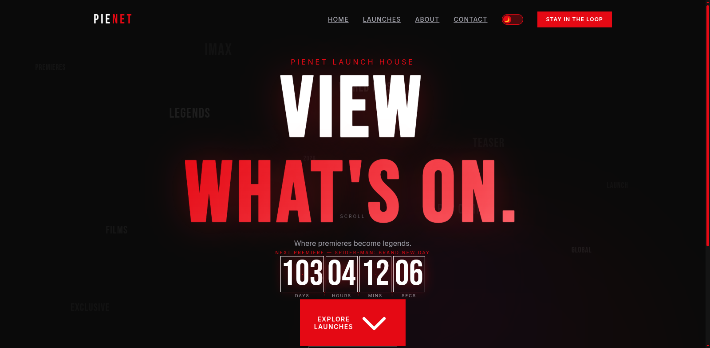
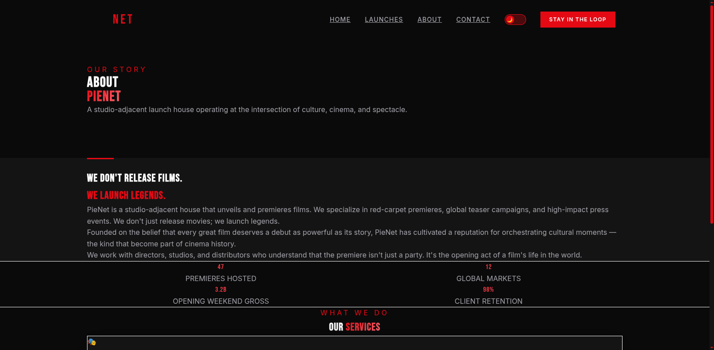
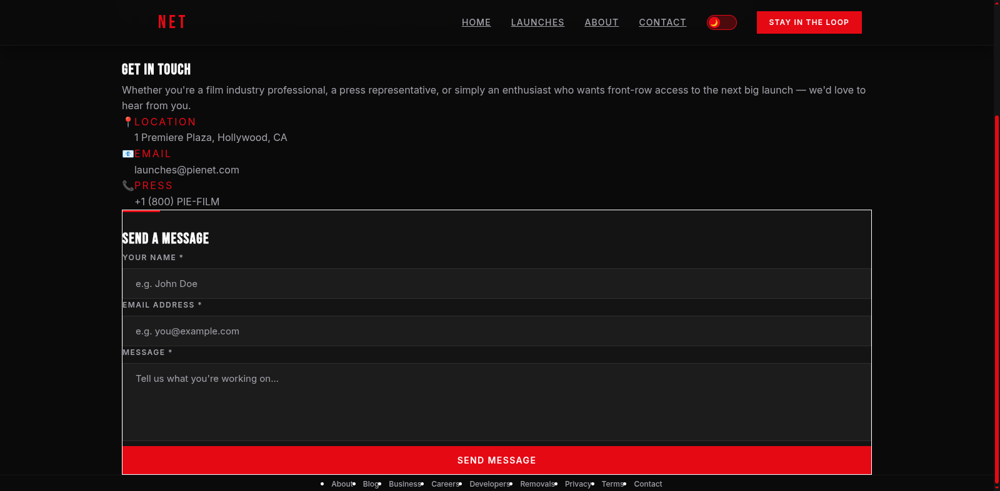

# PieNet Cinematic Launch House 🎬

Welcome to the **PieNet Cinematic Launch House**, a full-stack platform designed to deliver an immersive and cinematic experience for discovering and exploring films. 

The project features a sleek, modern, and highly responsive user interface with Pinterest-style minimal aesthetics, backed by a robust API.

---

## 📸 Screenshots

Here is a glimpse of the PieNet platform in action:

### Homepage


### About Page


### Contact Page


---

## 🛠️ Tech Stack

### Frontend
- **Framework:** [Next.js 16](https://nextjs.org/) (App Router, React 19)
- **Styling:** [Tailwind CSS v4](https://tailwindcss.com/)
- **Animations:** [Framer Motion](https://www.framer.com/motion/)
- **Data Fetching:** [React Query v5](https://tanstack.com/query/latest) & Axios
- **Language:** TypeScript

### Backend (API)
- **Framework:** [Laravel 13](https://laravel.com/)
- **Database:** SQLite / MySQL
- **Language:** PHP 8.3

---

## 🚀 Getting Started

To get the project running locally, you will need to start both the Laravel API and the Next.js frontend.

### Prerequisites
- Node.js (v20+)
- PHP (v8.3+)
- Composer

### 1. Setup the Backend (API)

Navigate to the `api` directory and set up the Laravel application:

```bash
cd api
composer install
cp .env.example .env
php artisan key:generate
php artisan migrate
php artisan serve
```

*The API will be available at `http://localhost:8000`.*

### 2. Setup the Frontend

Open a new terminal, navigate to the `frontend` directory, and start the development server:

```bash
cd frontend
npm install
npm run dev
```

*The frontend will be available at `http://localhost:3000`.*

---

## 📂 Project Structure

- `/api`: The Laravel application serving as the robust backend API.
- `/frontend`: The Next.js application powering the sleek, cinematic UI.
- `/imgreadme`: Contains screenshots of the application for documentation.

---

## 🌟 Key Features
- **Cinematic UI/UX:** A carefully crafted design focusing on visual excellence, featuring smooth gradients, dark mode aesthetics, and micro-animations.
- **Film Grid:** A dynamic and responsive grid for exploring a curated list of films.
- **Full-Stack Integration:** Live data communication between the React frontend and Laravel backend.

---

*Designed and developed for a premium cinematic browsing experience.*
